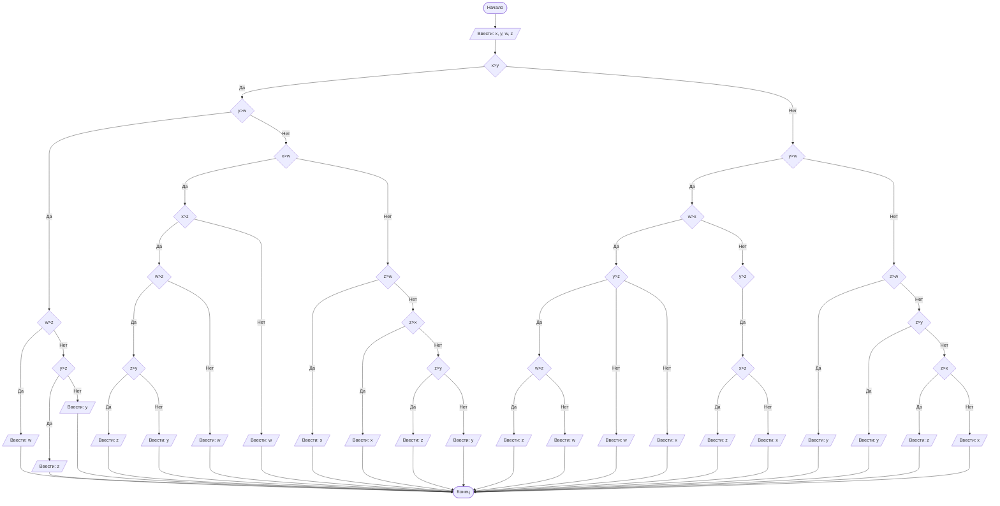

# lab-1
## Cодержание

1. [Отчет по лабораторной работе № 1](#отчет-по-лабораторной-работе--1)


## Отчет по лабораторной работе № 1

#### № группы: `ПМ-2402`

#### Выполнил: `Стадникова Диана Денисовна`

#### Вариант: `24`

### Cодержание:

- [Постановка задачи](#1-постановка-задачи)
- [Входные и выходные данные](#2-входные-и-выходные-данные)
- [Математическая модель](#25-математическая-модель)
- [Выбор структуры данных](#3-выбор-структуры-данных)
- [Алгоритм](#4-алгоритм)
- [Программа](#5-программа)
- [Анализ правильности решения](#6-анализ-правильности-решения)

### 1. Постановка задачи

- Условия задачи

> На вход программы подается четыре различных целых числа. Вывести на
экран число, которое меньше одного и больше двух других чисел (то есть,
это число в отсортированной последовательности стояло бы третьим).

- Программа получает на вход 4 различных числа,необходимо найти число,которое при расстановке по возрастанию будет стоять вторым
- Данную задачу можго разбить на два глобальных случая:
- выбрать две переменных(например,х и у) и начать рассмотривать их отношение друг к другу(то есть в первом случае у нас может быть х>у,а во втором-наоборот,
- третьего случая(равенства)не будет тк по условию задачи все числа различны. А далее под каждым случаем рассматривать отношения других чисел
- (грубо говоря,начинается комбинаторика, также стоит помнить,что у других переменных также надо будет проверить два варианта отношений
друг к другу то есть как мы делаем с х и у(x>y и x<y)

### 2. Входные и выходные данные
- на вход подается 4 целых различных числа: x,y,w,z;
- в условии не сказаны верхнии и нижние границы,поэтому установим их самостоятельно

|             | Тип         |   min значение  | max значение   |
|-------------|-------------|-----------------|----------------|
| x (Число 1) | целое число | -10<sup>9</sup>  | 10<sup>9</sup> |
| y (Число 2) | целое число | -10<sup>9</sup> | 10<sup>9</sup> |
| w (Число 2) | целое число | -10<sup>9</sup> | 10<sup>9</sup> |
| z (Число 2) | целое число | -10<sup>9</sup> | 10<sup>9</sup> |


#### Данные на выход

Т.к. программа должна вывести одно число из четырех,поэтому мин и макс значения не поменяются и на выход мы получим 
единственное целое число.

|         | Тип                         |    min значение    |  max значение  |
|---------|-----------------------------|--------------------|----------------|
| Число 1 | целое неотрицательное число |  -10<sup>9</sup>   | 10<sup>9</sup> |


### 3. Выбор структуры данных

Программа получает 4 целых числа, не превышающих по модулю 10<sup>9</sup> < 2<sup>30</sup>. Поэтому для их хранения
можно выделить 4 переменных (`x`, `y`, `w`,`z`) типа `int`.

|             | название переменной | Тип (в Java)| 
|-------------|---------------------|-------------|
| x (Число 1) |         `x`         |   `int`     |
| y (Число 2) |         `y`         |   `int`     | 
| w (Число 3) |         `w`         |   `int`     |
| z (Число 4) |         `z`         |   `int`     |

Для вывода результата необязательно его хранить в отдельной переменной

### 4. Алгоритм
1. **Ввод данных:**  
   Программа считывает четыре целых числа, обозначенные как `x`,`y`,`w`,`z`.

2. **Сравнение чисел:**
 1 случай:
 х>y
представим как могут быть расположены пременные
Например,так:xywz
тогда рассматриваем случаи(y>w,w>z,y>z,а далее обратные неравенства(тоже будут строгими <),
но там добавятся случаи(к примеру если рассмтореть y<w,то появляются варианты с х:x>w x<w и т.п))
Далее случай 2: х<y
и также рассматриваем неравенства как в первом случае
В 1 лабораторной работе блок-схем обязательна. Ниже представлен пример с лекции,
реализованный с помощью `mermaid` - инструментом для рисования диаграмм и блок-схем.



### 5. Программа

```javascript
                import java.io.PrintStream;
                import java.util.Scanner;
                public class Main {
                    // Объявляем объект класса PrintStream для вывода данных
                    public static Scanner in = new Scanner(System.in);
                    public static PrintStream out = System.out;
                    public static void main(String[] args) {
                      int x = in.nextInt();
                    int y = in.nextInt();
                    int w = in.nextInt();
                    int z = in.nextInt();
                    if (x>y)
                        if (y>w)
                            if (w>z)
                                out.print(w);
                            else
                                if (y>z)
                                    out.print(z);
                                else
                                    out.print(y);
                        else
                            if (x>w)
                                if (x>z)
                                    if (w>z)
                                        if (z>y)
                                            out.print(z);
                                        else
                                            out.print(y);
                                    else
                                        out.print(w);
                                else
                                    out.print(w);
                            else
                                if (z>w)
                                    out.print(x);
                                else
                                    if (z>x)
                                        out.print(x);
                                    else
                                        if (z>y)
                                            out.print(z);
                                        else
                                            out.print(y);
                    else
                        if (y>w)
                            if (w>x)
                                if (y>z)
                                    if (w>z)
                                        out.print(z);
                                    else
                                        out.print(w);
                                else
                                    out.print(w);
                            else
                                if (y>z)
                                    if (x>z)
                                        out.print(z);
                                    else
                                        out.print(x);
                                else
                                    out.print(x);
                        else
                            if (z>w)
                                out.print(y);
                            else
                                if (z>y)
                                    out.print(y);
                                else
                                    if (z>x)
                                        out.print(z);
                                    else
                                        out.print(x);
          
                            }
                        }
         
      
```
        

### 6. Анализ правильности решения

1. Тест на что-то

- Input:
    ```
    1
    1
    ```

- Output:
    ```
    2
    ```

2. Тест на что-то еще

- Input:
    ```
    1
    -1
    ```

- Output:
    ```
    0
    ```

                                                                                                                                                                      | **0** - **100** |
